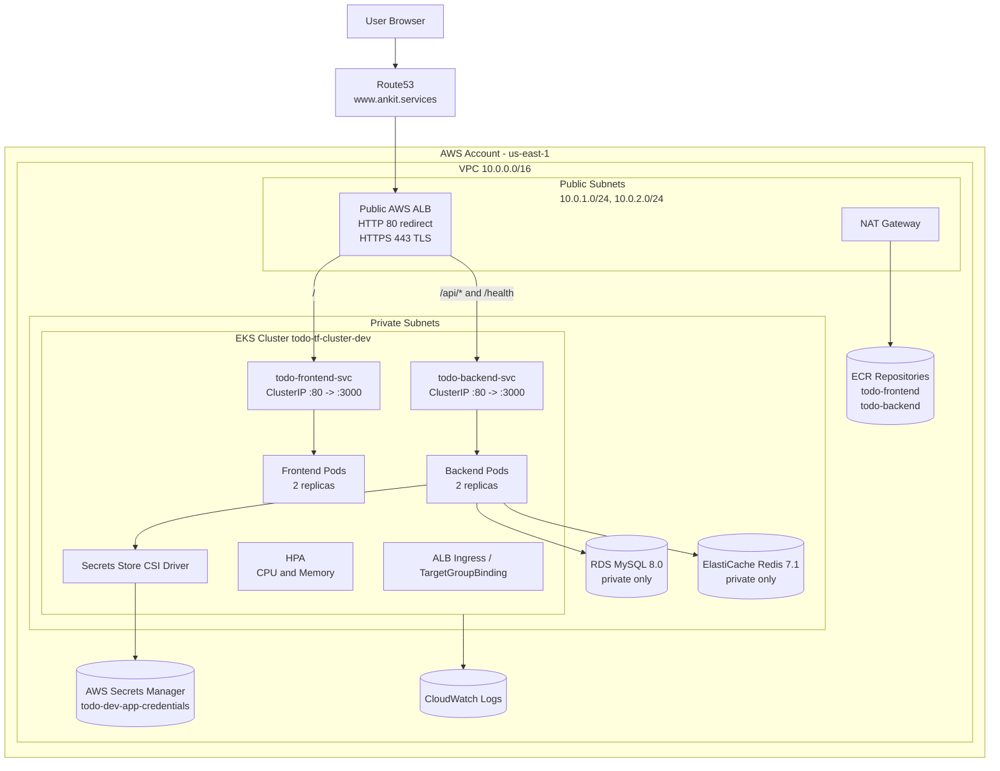
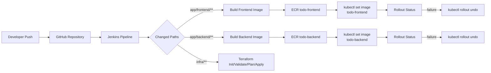
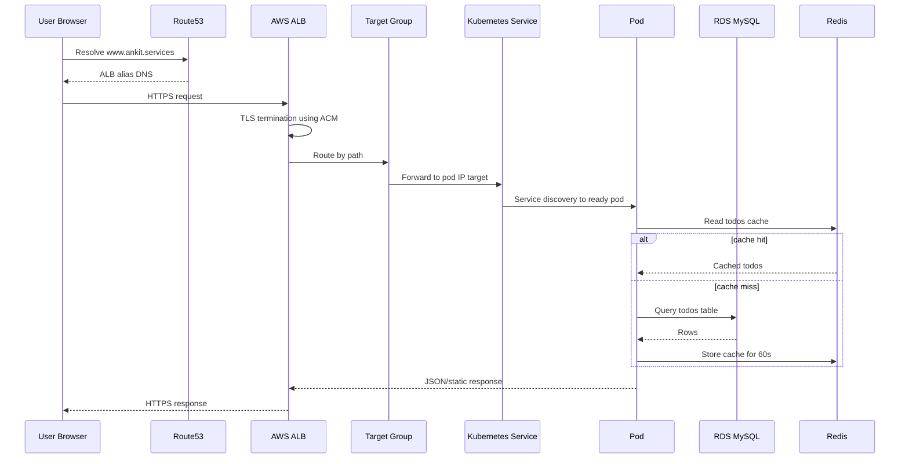

# Todo Fullstack Platform - Complete Implementation Guide

## Table of Contents

1. [Target Architecture](#1-target-architecture)
2. [Prerequisites](#2-prerequisites)
3. [Project Architecture Overview](#3-project-architecture-overview)
4. [Implementation Phases](#4-implementation-phases)
5. [Complete Traffic Flow](#5-complete-traffic-flow)
6. [Complete CI/CD Flow](#6-complete-cicd-flow)
7. [Scaling Architecture](#7-scaling-architecture)
8. [Security Architecture](#8-security-architecture)
9. [Monitoring and Logging](#9-monitoring-and-logging)
10. [Troubleshooting](#10-troubleshooting)
11. [Final Outcome](#11-final-outcome)

---

## 1. Target Architecture

This project builds a production-style cloud-native Todo application on AWS. The platform uses Terraform for infrastructure provisioning, Amazon EKS for Kubernetes orchestration, Amazon RDS MySQL for durable data storage, Amazon ElastiCache Redis for caching, Amazon ECR for container images, an AWS Application Load Balancer for public ingress, Route53 for DNS, ACM for TLS, and Jenkins for CI/CD automation.

The application has two runtime components:

- `todo-frontend`: static HTML/CSS/JavaScript served by a Node `serve` process on port `3000`.
- `todo-backend`: Express.js API service on port `3000`, connected to MySQL and Redis.

The backend exposes:

- `GET /health`
- `GET /api/todos`
- `POST /api/todos`
- `PUT /api/todos/:id`
- `DELETE /api/todos/:id`

The final system is deployed into the `todo` Kubernetes namespace. Both frontend and backend run as multi-replica Kubernetes Deployments with rolling updates, readiness probes, liveness probes, PodDisruptionBudgets, NetworkPolicies, and HPAs.

### Single-Page Architecture Diagram



### Request Flow

1. A user opens `https://www.ankit.services`.
2. Route53 resolves the hostname to the public Application Load Balancer.
3. The ALB terminates HTTPS using the ACM certificate configured in Terraform and Kubernetes annotations.
4. The ALB forwards `/` traffic to the frontend target group and `/api/*` plus `/health` traffic to the backend target group.
5. TargetGroupBinding resources register Kubernetes pod IPs directly into the ALB target groups because target type is `ip`.
6. The frontend serves static assets and calls API paths under `/api`.
7. The backend reads and writes Todo records in RDS MySQL.
8. Redis caches the `GET /api/todos` response for 60 seconds and is invalidated on create, update, and delete.
9. The response returns through the same path to the user.

### CI/CD Flow



Jenkins builds only the image affected by the changed path. It tags images as `v${BUILD_NUMBER}` and `latest`, pushes them to ECR, updates the Kubernetes Deployment image, waits for rollout completion, and rolls back if the rollout fails.

### Deployment and Scaling Model

The platform scales at two layers:

- Pod layer: Kubernetes HPA scales `todo-backend` from 2 to 10 replicas and `todo-frontend` from 2 to 6 replicas based on CPU and memory utilization.
- Node layer: the EKS managed node group starts with a desired size from Terraform and can scale through the node group Auto Scaling Group. Terraform also creates IAM permissions for Cluster Autoscaler and an ASG CPU target tracking policy.

---

## 2. Prerequisites

### AWS Account

An AWS account is required because this project provisions real cloud resources: VPC, subnets, NAT Gateway, EKS, managed node groups, RDS, ElastiCache, ALB, ECR, S3, Route53 records, IAM roles, and Secrets Manager secrets.

Required permissions for the provisioning identity:

- VPC, EC2, Subnet, NAT Gateway, Internet Gateway, Route Table, Security Group management
- EKS cluster, node group, add-on, and OIDC provider management
- IAM role, policy, and policy attachment management
- ECR repository and lifecycle policy management
- RDS instance and subnet group management
- ElastiCache replication group and subnet group management
- ELBv2 ALB, listener, listener rule, and target group management
- Route53 hosted zone read and record write access
- ACM certificate read access
- S3 bucket access for Terraform state
- Secrets Manager secret read/write access
- CloudWatch log group management

### Domain, Route53, and ACM

The repository is configured for:

- Root domain: `ankit.services`
- Application host: `www.ankit.services`
- Jenkins host: `jenkins.ankit.services`
- Region: `us-east-1`

Before Terraform can create the application DNS record, the public hosted zone for `ankit.services` must already exist in Route53. Terraform looks it up using `data "aws_route53_zone"`.

Before the ALB HTTPS listener can be created, an ACM certificate must already exist in `us-east-1`. The dev variable file currently references:

```text
arn:aws:acm:us-east-1:668076964228:certificate/e4a2f397-c129-4501-b3bd-b4ab9d6f22d7
```

For a fresh rebuild, replace this ARN with the certificate ARN from the target AWS account.

### Required Tools

| Tool | Why it is needed | Minimum version | Install command | Verification |
|---|---|---:|---|---|
| Git | Clone and manage the repository | 2.30+ | `sudo apt-get install -y git` | `git --version` |
| AWS CLI | Authenticate to AWS, ECR, and EKS | 2.x | `curl "https://awscli.amazonaws.com/awscli-exe-linux-x86_64.zip" -o awscliv2.zip` then `unzip awscliv2.zip && sudo ./aws/install` | `aws --version` |
| Terraform | Provision AWS infrastructure | 1.6+ | Install from HashiCorp releases or package repo | `terraform version` |
| kubectl | Manage Kubernetes resources | 1.30.x recommended | `curl -LO https://dl.k8s.io/release/v1.30.0/bin/linux/amd64/kubectl && chmod +x kubectl && sudo mv kubectl /usr/local/bin/` | `kubectl version --client` |
| Helm | Install Kubernetes controllers such as Jenkins and optional autoscaler manifests | 3.x | `curl https://raw.githubusercontent.com/helm/helm/main/scripts/get-helm-3 | bash` | `helm version` |
| Docker | Build and push application images | 24+ | `sudo apt-get install -y docker.io` | `docker version` |
| Node.js | Local backend/frontend validation | 20.x | `curl -fsSL https://deb.nodesource.com/setup_20.x | sudo -E bash - && sudo apt-get install -y nodejs` | `node --version` |
| npm | Install backend dependencies locally | Bundled with Node 20 | Installed with Node.js | `npm --version` |
| Jenkins | Run CI/CD automation | LTS recommended | Installed in Kubernetes through Helm using `infra/ci-cd/jenkins-values.yaml` | Jenkins UI and pipeline run |

### AWS CLI Authentication

Configure credentials before running Terraform:

```bash
aws configure
aws sts get-caller-identity
```

Expected output:

```json
{
  "UserId": "...",
  "Account": "668076964228",
  "Arn": "arn:aws:iam::668076964228:user/..."
}
```

If the account ID differs, update account-specific values in Terraform variables, Jenkins values, Kubernetes manifests, and ECR image references.

---

## 3. Project Architecture Overview

### Repository Layout

```text
todo-fullstack/
├── app/
│   ├── backend/                 # Express API, MySQL and Redis clients
│   ├── frontend/                # Static Todo UI
│   ├── docker/                  # Dockerfiles and local docker-compose
│   ├── k8s/                     # Kubernetes namespace, workloads, services, ingress, HPA, PDB
│   └── ci/deploy.sh             # Deployment helper script
├── infra/
│   ├── terraform/               # Terraform root module and AWS modules
│   └── ci-cd/                   # Jenkinsfile and Jenkins Helm values
└── docs/                        # Architecture and operations documentation
```

### Infrastructure Architecture

Terraform provisions:

- VPC `10.0.0.0/16`
- Two public subnets for the internet-facing ALB and NAT Gateway
- Two private subnets for EKS nodes, RDS, and Redis
- Internet Gateway and one NAT Gateway
- Security groups for ALB, EKS nodes, RDS, and Redis
- EKS cluster `todo-tf-cluster-dev`
- EKS managed node group with `t3.medium` nodes
- EKS add-ons: VPC CNI, kube-proxy, CoreDNS, EBS CSI driver
- OIDC provider and IRSA roles
- ECR repositories: `todo-frontend` and `todo-backend`
- RDS MySQL 8.0 instance
- ElastiCache Redis 7.1 replication group
- Secrets Manager secret containing database and Redis connection values
- Public ALB, HTTPS listener, HTTP redirect listener, frontend/backend target groups
- Route53 alias record for `www.ankit.services`
- CloudWatch log groups
- S3 bucket for assets
- IAM role for Jenkins service account

### Kubernetes Architecture

Kubernetes manifests create:

- Namespace: `todo`
- ConfigMap: `todo-config`
- ServiceAccount: `todo-backend-sa` with IAM role annotation
- SecretProviderClass: syncs AWS Secrets Manager values into Kubernetes Secret `todo-secret`
- Deployments: `todo-frontend`, `todo-backend`
- Services: `todo-frontend-svc`, `todo-backend-svc`
- Ingress: ALB-based routing for `www.ankit.services`
- TargetGroupBinding: binds Kubernetes services to Terraform-created target groups
- HPA: CPU and memory based autoscaling
- PDB: protects minimum availability during voluntary disruptions
- NetworkPolicy: limits pod ingress paths and keeps database/cache traffic private

### Networking Architecture

Public subnets contain internet-facing components. Private subnets contain compute and data services. EKS nodes are private and reach the internet through the NAT Gateway for image pulls and outbound dependencies. RDS and Redis are not publicly accessible. Security group rules allow database and cache access only from EKS worker nodes.

### Security Architecture

Security is implemented through:

- HTTPS on the ALB using ACM
- HTTP to HTTPS redirect
- Private EKS node subnets
- Private RDS and Redis
- Security group isolation
- IRSA for AWS Secrets Manager access
- Non-root containers
- Dropped Linux capabilities
- Kubernetes NetworkPolicies
- ECR image scan on push
- Encrypted RDS storage
- Encrypted Redis at rest
- Encrypted S3 bucket
- IMDSv2 enforced on EKS worker nodes

### Container Architecture

The backend image is built from `node:20-alpine`, installs production dependencies with `npm ci --omit=dev`, runs as a non-root user, and starts `node src/app.js`.

The frontend image is built from `node:20-alpine`, installs `serve@14`, copies static files, runs as a non-root user, and serves the frontend on port `3000`.

---

## 4. Implementation Phases

## Phase 1 - AWS and Domain Setup

### Goal

Prepare the AWS account, domain, certificate, and Terraform state backend required before infrastructure provisioning.

### What We Are Building

This phase prepares:

- AWS CLI authentication
- Route53 hosted zone
- ACM certificate
- S3 bucket for Terraform state

### Why This Phase Matters

Terraform depends on pre-existing account access, a valid Route53 hosted zone, and a valid ACM certificate ARN. Without these, the ALB, HTTPS listener, and DNS alias cannot be created.

### Step-by-Step Implementation

Authenticate to AWS:

```bash
aws configure
aws sts get-caller-identity
```

This confirms that the local machine can call AWS APIs.

Expected output includes the AWS account ID:

```text
"Account": "668076964228"
```

Create or verify the public hosted zone:

```bash
aws route53 list-hosted-zones-by-name --dns-name ankit.services
```

Expected output:

```text
HostedZones contains ankit.services.
```

Request or verify an ACM certificate in `us-east-1`:

```bash
aws acm list-certificates --region us-east-1
```

Expected output:

```text
CertificateSummaryList contains a certificate for www.ankit.services or *.ankit.services.
```

Create the Terraform state bucket if it does not already exist:

```bash
aws s3 mb s3://todo-tf-state-668076964228 --region us-east-1
aws s3api put-bucket-versioning --bucket todo-tf-state-668076964228 --versioning-configuration Status=Enabled
```

The repository backend uses:

```hcl
bucket       = "todo-tf-state-668076964228"
key          = "todo-fullstack/default.tfstate"
region       = "us-east-1"
encrypt      = true
use_lockfile = true
```

### Verification

```bash
aws s3api get-bucket-versioning --bucket todo-tf-state-668076964228
aws acm describe-certificate --region us-east-1 --certificate-arn <CERTIFICATE_ARN>
```

Expected output:

```text
Status: Enabled
Certificate Status: ISSUED
```

### Common Issues and Troubleshooting

| Symptom | Root cause | Fix | Prevention |
|---|---|---|---|
| `AccessDenied` from AWS CLI | IAM user or role lacks permissions | Use a provisioning role with required AWS permissions | Maintain a documented deployment IAM role |
| Terraform cannot find hosted zone | Route53 zone does not exist or domain name differs | Create/import the hosted zone or update `domain_name` | Validate DNS before Terraform |
| ALB listener creation fails | ACM certificate is missing, pending validation, or in wrong region | Use an issued certificate in `us-east-1` | Validate certificate status before apply |

## Phase 2 - Terraform Configuration

### Goal

Configure Terraform variables so the infrastructure matches the target AWS account, domain, and environment.

### What We Are Building

This phase prepares `infra/terraform/environments/dev/terraform.tfvars`.

### Why This Phase Matters

Terraform modules are reusable, but the environment file controls names, CIDRs, scaling sizes, database settings, Redis size, DNS hostnames, and the certificate ARN.

### Step-by-Step Implementation

Open:

```text
infra/terraform/environments/dev/terraform.tfvars
```

Review and update:

```hcl
aws_region   = "us-east-1"
project_name = "todo"
environment  = "dev"

domain_name = "ankit.services"
subdomain   = "www"

certificate_arn = "<ACM_CERTIFICATE_ARN>"
s3_bucket_name  = "todo-assets-dev-<ACCOUNT_ID>"
```

Do not commit real database passwords. Prefer environment variable injection:

```bash
export TF_VAR_rds_password='<strong-password>'
```

This overrides the placeholder value in `terraform.tfvars`.

### Verification

```bash
terraform -chdir=infra/terraform fmt -check -recursive
terraform -chdir=infra/terraform validate
```

Expected output:

```text
Success! The configuration is valid.
```

### Common Issues and Troubleshooting

| Symptom | Root cause | Fix | Prevention |
|---|---|---|---|
| `No value for required variable` | Required value missing | Export `TF_VAR_rds_password` or set tfvars | Keep a sanitized environment template |
| Duplicate S3 bucket name | S3 names are globally unique | Add account ID or environment suffix | Use deterministic account-specific names |
| Invalid CIDR overlap | VPC/subnet CIDRs overlap | Correct subnet ranges | Reserve CIDR ranges per environment |

## Phase 3 - Infrastructure Provisioning

### Goal

Provision the AWS foundation and managed services using Terraform.

### What We Are Building

Terraform creates:

- VPC, subnets, route tables, NAT Gateway, Internet Gateway
- Security groups
- CloudWatch log groups
- ECR repositories
- EKS cluster and node group
- EKS add-ons and OIDC provider
- RDS MySQL
- ElastiCache Redis
- Secrets Manager secret and backend IRSA role
- S3 bucket
- ALB, target groups, listeners, listener rules
- Route53 alias record
- Jenkins IRSA role
- Cluster Autoscaler IAM role

### Why This Phase Matters

This phase creates the durable cloud platform that Kubernetes and CI/CD will use. It also generates outputs that must be copied into Kubernetes manifests, such as ECR repository URLs, target group ARNs, and IAM role ARNs.

### Step-by-Step Implementation

Initialize Terraform:

```bash
terraform -chdir=infra/terraform init -backend-config=environments/dev/backend.tf
```

This downloads providers and connects Terraform to the S3 backend.

Validate:

```bash
terraform -chdir=infra/terraform validate
```

Create a plan:

```bash
terraform -chdir=infra/terraform plan -var-file=environments/dev/terraform.tfvars -out=tfplan
```

The plan should show resources to create across AWS networking, EKS, RDS, Redis, ALB, Route53, ECR, IAM, and CloudWatch.

Apply:

```bash
terraform -chdir=infra/terraform apply tfplan
```

### Expected Output

Terraform completes with outputs similar to:

```text
eks_cluster_name = "todo-tf-cluster-dev"
app_url = "https://www.ankit.services"
ecr_frontend_repository_url = ".../todo-frontend"
ecr_backend_repository_url = ".../todo-backend"
alb_dns_name = "todo-dev-alb-..."
frontend_tg_arn = "arn:aws:elasticloadbalancing:..."
backend_tg_arn = "arn:aws:elasticloadbalancing:..."
todo_backend_irsa_role_arn = "arn:aws:iam::...:role/todo-dev-todo-backend-role"
```

### Verification

```bash
terraform -chdir=infra/terraform output
aws eks describe-cluster --region us-east-1 --name todo-tf-cluster-dev --query cluster.status
aws ecr describe-repositories --region us-east-1
```

Expected output:

```text
"ACTIVE"
todo-frontend
todo-backend
```

### Common Issues and Troubleshooting

| Symptom | Root cause | Fix | Prevention |
|---|---|---|---|
| EKS creation times out | AWS EKS provisioning delay | Re-run `terraform apply` after checking cluster status | Allow 15-25 minutes for EKS |
| RDS fails due weak password | Password does not meet RDS rules | Use a stronger password | Use generated secrets |
| ALB HTTPS listener fails | Empty or invalid `certificate_arn` | Set a valid ACM ARN | Verify ACM before apply |
| Route53 record fails | Hosted zone lookup failed | Correct `domain_name` | Confirm hosted zone exists |

## Phase 4 - EKS Configuration

### Goal

Connect `kubectl` to the new EKS cluster and verify the managed node group.

### What We Are Building

This phase creates the local kubeconfig context for the EKS cluster.

### Why This Phase Matters

Kubernetes manifests cannot be applied until the operator machine or Jenkins agent can authenticate to the EKS API server.

### Step-by-Step Implementation

Update kubeconfig:

```bash
aws eks update-kubeconfig --region us-east-1 --name todo-tf-cluster-dev
```

Check cluster access:

```bash
kubectl cluster-info
kubectl get nodes -o wide
```

### Expected Output

```text
Kubernetes control plane is running
NAME             STATUS   ROLES    AGE   VERSION
ip-10-0-...      Ready    <none>   ...   v1.30...
```

### Verification

```bash
kubectl get pods -n kube-system
kubectl get csidrivers
```

Expected output includes CoreDNS, kube-proxy, VPC CNI, EBS CSI, and Secrets Store CSI driver resources.

### Common Issues and Troubleshooting

| Symptom | Root cause | Fix | Prevention |
|---|---|---|---|
| `Unauthorized` from kubectl | IAM principal not mapped to cluster access | Use the same role that created the cluster or configure access entries | Standardize deployment identity |
| Nodes not Ready | CNI, IAM, or subnet issue | Inspect `kubectl describe node` and `kube-system` pods | Validate node IAM policies and subnet tags |
| CoreDNS pending | Node group not ready | Wait for nodes or inspect ASG | Provision node group before add-ons |

## Phase 5 - Kubernetes Controllers

### Goal

Install and verify controllers required by the Kubernetes manifests.

### What We Are Building

This phase covers:

- Secrets Store CSI Driver
- AWS Secrets Manager CSI Provider
- AWS Load Balancer Controller
- Metrics Server
- Cluster Autoscaler

Terraform already installs the Secrets Store CSI Driver and AWS provider through Helm:

- `secrets-store-csi-driver` version `1.4.4`
- `secrets-store-csi-driver-provider-aws` version `0.3.9`

Terraform also creates the IAM role for the AWS Load Balancer Controller, but the controller itself must be installed in the cluster if it is not already present.

### Why This Phase Matters

The application manifests depend on controller CRDs:

- `SecretProviderClass` requires Secrets Store CSI CRDs.
- `TargetGroupBinding` requires AWS Load Balancer Controller CRDs.
- HPA requires Metrics Server.
- Node scaling requires Cluster Autoscaler deployment if autoscaling beyond ASG CPU policy is desired.

### Step-by-Step Implementation

Verify Secrets Store CSI:

```bash
kubectl get pods -n kube-system | grep secrets-store
kubectl get crd | grep secretproviderclasses
```

Install AWS Load Balancer Controller if missing:

```bash
helm repo add eks https://aws.github.io/eks-charts
helm repo update
helm upgrade --install aws-load-balancer-controller eks/aws-load-balancer-controller \
  -n kube-system \
  --set clusterName=todo-tf-cluster-dev \
  --set serviceAccount.create=true \
  --set serviceAccount.name=aws-load-balancer-controller \
  --set serviceAccount.annotations."eks\.amazonaws\.com/role-arn"=<eks_alb_controller_role_arn> \
  --set region=us-east-1 \
  --set vpcId=<vpc_id>
```

Install Metrics Server if missing:

```bash
kubectl apply -f https://github.com/kubernetes-sigs/metrics-server/releases/latest/download/components.yaml
```

Install Cluster Autoscaler if required by platform policy. Terraform creates the IRSA role output `cluster_autoscaler_role_arn`; the deployment manifest must use service account `kube-system/cluster-autoscaler`.

### Expected Output

```text
deployment.apps/aws-load-balancer-controller
deployment.apps/metrics-server
customresourcedefinition.apiextensions.k8s.io/targetgroupbindings.elbv2.k8s.aws
```

### Verification

```bash
kubectl get deployment -n kube-system aws-load-balancer-controller
kubectl get apiservice v1beta1.metrics.k8s.io
kubectl top nodes
```

### Common Issues and Troubleshooting

| Symptom | Root cause | Fix | Prevention |
|---|---|---|---|
| `no matches for kind TargetGroupBinding` | AWS Load Balancer Controller CRDs missing | Install AWS Load Balancer Controller | Install controllers before app manifests |
| `SecretProviderClass` unknown | Secrets Store CSI CRDs missing | Re-run Terraform Helm install or install driver manually | Verify CRDs before deploy |
| HPA shows `<unknown>` metrics | Metrics Server missing or unhealthy | Install/fix Metrics Server | Include metrics server in cluster baseline |

## Phase 6 - Docker Image Build

### Goal

Build and push the frontend and backend images to ECR.

### What We Are Building

This phase creates:

- `todo-frontend:latest`
- `todo-backend:latest`

### Why This Phase Matters

Kubernetes Deployments reference ECR images. Pods cannot start until those images exist and the worker nodes can pull them.

### Step-by-Step Implementation

Authenticate Docker to ECR:

```bash
aws ecr get-login-password --region us-east-1 | docker login --username AWS --password-stdin 668076964228.dkr.ecr.us-east-1.amazonaws.com
```

Build frontend:

```bash
docker build -f app/docker/Dockerfile.frontend -t 668076964228.dkr.ecr.us-east-1.amazonaws.com/todo-frontend:latest app/frontend/
```

Build backend:

```bash
docker build -f app/docker/Dockerfile.backend -t 668076964228.dkr.ecr.us-east-1.amazonaws.com/todo-backend:latest app/backend/
```

Push images:

```bash
docker push 668076964228.dkr.ecr.us-east-1.amazonaws.com/todo-frontend:latest
docker push 668076964228.dkr.ecr.us-east-1.amazonaws.com/todo-backend:latest
```

### Expected Output

```text
latest: digest: sha256:...
```

### Verification

```bash
aws ecr describe-images --region us-east-1 --repository-name todo-frontend
aws ecr describe-images --region us-east-1 --repository-name todo-backend
```

### Common Issues and Troubleshooting

| Symptom | Root cause | Fix | Prevention |
|---|---|---|---|
| `no basic auth credentials` | Docker not logged in to ECR | Re-run ECR login command | Login immediately before push |
| Build fails during `npm ci` | Lockfile/dependency issue | Check `package-lock.json` and Node version | Build with Node 20 |
| Pods show `ImagePullBackOff` | Image not pushed or wrong account/region | Push image and update Deployment image | Generate image URLs from Terraform outputs |

## Phase 7 - Kubernetes Manifest Preparation

### Goal

Update Kubernetes manifests with values generated by Terraform.

### What We Are Building

This phase prepares:

- ECR image URLs in `deployment.yaml`
- Backend IRSA role ARN in `serviceaccount.yaml`
- Secret name and region in `secretproviderclass.yaml`
- ALB ARN and target group ARNs in `ingress.yaml` and `targetgroupbinding.yaml`
- Domain and allowed origin values

### Why This Phase Matters

Several Kubernetes manifests contain account-specific ARNs. After a fresh rebuild, old ARNs will not work in the new account or newly provisioned ALB.

### Step-by-Step Implementation

Collect Terraform outputs:

```bash
terraform -chdir=infra/terraform output ecr_frontend_repository_url
terraform -chdir=infra/terraform output ecr_backend_repository_url
terraform -chdir=infra/terraform output todo_backend_irsa_role_arn
terraform -chdir=infra/terraform output secrets_manager_secret_name
terraform -chdir=infra/terraform output alb_arn
terraform -chdir=infra/terraform output frontend_tg_arn
terraform -chdir=infra/terraform output backend_tg_arn
```

Update `app/k8s/deployment.yaml`:

```yaml
image: <ecr_frontend_repository_url>:latest
image: <ecr_backend_repository_url>:latest
```

Update `app/k8s/serviceaccount.yaml`:

```yaml
eks.amazonaws.com/role-arn: "<todo_backend_irsa_role_arn>"
```

Update `app/k8s/secretproviderclass.yaml`:

```yaml
objectName: "<secrets_manager_secret_name>"
region: us-east-1
```

Update `app/k8s/targetgroupbinding.yaml`:

```yaml
targetGroupARN: <frontend_tg_arn>
targetGroupARN: <backend_tg_arn>
```

Update `app/k8s/ingress.yaml` if using the Ingress path:

```yaml
alb.ingress.kubernetes.io/load-balancer-arn: <alb_arn>
alb.ingress.kubernetes.io/certificate-arn: <certificate_arn>
host: www.ankit.services
```

### Verification

```bash
grep -R "668076964228" app/k8s
grep -R "arn:aws" app/k8s
```

Expected result: all account-specific values should match the target account and current Terraform outputs.

### Common Issues and Troubleshooting

| Symptom | Root cause | Fix | Prevention |
|---|---|---|---|
| Backend cannot read secrets | Wrong service account role ARN | Replace with Terraform output | Automate manifest templating |
| Target groups remain empty | Wrong target group ARN | Update TargetGroupBinding ARNs | Always refresh ARNs after ALB recreation |
| TLS host mismatch | Wrong domain or certificate | Use certificate covering host | Validate certificate SANs |

## Phase 8 - Application Deployment

### Goal

Deploy the Todo application workloads into EKS.

### What We Are Building

This phase creates the Kubernetes namespace, configuration, secrets sync, services, deployments, traffic routing, NetworkPolicies, PDBs, and HPAs.

### Why This Phase Matters

This connects the application images to the infrastructure services and exposes the application through the ALB.

### Step-by-Step Implementation

Apply the namespace first:

```bash
kubectl apply -f app/k8s/namespace.yaml
```

Apply configuration and service account:

```bash
kubectl apply -f app/k8s/configmap.yaml
kubectl apply -f app/k8s/serviceaccount.yaml
kubectl apply -f app/k8s/secretproviderclass.yaml
```

Apply workloads and services:

```bash
kubectl apply -f app/k8s/deployment.yaml
kubectl apply -f app/k8s/service.yaml
```

Apply traffic and reliability manifests:

```bash
kubectl apply -f app/k8s/targetgroupbinding.yaml
kubectl apply -f app/k8s/ingress.yaml
kubectl apply -f app/k8s/networkpolicy.yaml
kubectl apply -f app/k8s/pdb.yaml
kubectl apply -f app/k8s/hpa.yaml
```

### Expected Output

```text
namespace/todo created
deployment.apps/todo-frontend created
deployment.apps/todo-backend created
service/todo-frontend-svc created
service/todo-backend-svc created
```

### Verification

```bash
kubectl get all -n todo
kubectl get targetgroupbinding -n todo
kubectl get ingress -n todo
kubectl get secret todo-secret -n todo
kubectl rollout status deployment/todo-frontend -n todo
kubectl rollout status deployment/todo-backend -n todo
```

Expected output:

```text
deployment "todo-frontend" successfully rolled out
deployment "todo-backend" successfully rolled out
```

### Common Issues and Troubleshooting

| Symptom | Root cause | Fix | Prevention |
|---|---|---|---|
| Pods pending | No schedulable nodes or insufficient resources | Check nodes and node group size | Size node group for baseline replicas |
| Backend CrashLoopBackOff | DB, Redis, or secret values unavailable | Check logs and secret sync | Deploy SecretProviderClass before backend |
| TargetGroupBinding fails | AWS Load Balancer Controller missing | Install controller | Verify CRDs before apply |

## Phase 9 - Verification and Testing

### Goal

Confirm that the application works from inside the cluster and from the public DNS endpoint.

### What We Are Testing

- Pod readiness
- Service routing
- Backend health
- ALB target health
- DNS resolution
- HTTPS
- Database writes
- Redis cache behavior

### Step-by-Step Implementation

Check pods:

```bash
kubectl get pods -n todo -o wide
```

Check backend health through service:

```bash
kubectl run curl-test -n todo --rm -it --image=curlimages/curl -- curl http://todo-backend-svc/health
```

Expected output:

```json
{"status":"OK","version":"v4"}
```

Check ALB target groups:

```bash
aws elbv2 describe-target-health --region us-east-1 --target-group-arn <frontend_tg_arn>
aws elbv2 describe-target-health --region us-east-1 --target-group-arn <backend_tg_arn>
```

Expected output:

```text
State: healthy
```

Check public endpoint:

```bash
curl -I https://www.ankit.services
curl https://www.ankit.services/health
```

Create a Todo:

```bash
curl -X POST https://www.ankit.services/api/todos \
  -H "Content-Type: application/json" \
  -d '{"title":"first production test"}'
```

List Todos:

```bash
curl https://www.ankit.services/api/todos
```

### Common Issues and Troubleshooting

| Symptom | Root cause | Fix | Prevention |
|---|---|---|---|
| `503 Service Temporarily Unavailable` | No healthy ALB targets | Check target health and readiness probes | Verify target groups after deploy |
| `/` works but `/api` fails | Backend service or path rule issue | Check ALB listener rule and service selector | Keep labels/selectors consistent |
| Health works but Todo API fails | DB or Redis connection issue | Inspect backend logs | Verify Secrets Manager and SG rules |

## Phase 10 - Jenkins CI/CD Setup

### Goal

Deploy Jenkins into EKS and configure the pipeline to build, push, deploy, and manage infrastructure changes.

### What We Are Building

This phase creates:

- Jenkins controller in Kubernetes
- Jenkins Kubernetes agents
- Custom Jenkins agent image with Docker CLI, AWS CLI, kubectl, and Terraform
- Jenkins service account with IRSA
- Pipeline from `infra/ci-cd/Jenkinsfile`

### Why This Phase Matters

Jenkins automates repeatable deployments. It builds only changed application components and applies infrastructure only when `infra/**` changes.

### Step-by-Step Implementation

Build and push Jenkins agent image:

```bash
docker build -f app/docker/Dockerfile.jenkins-agent -t 668076964228.dkr.ecr.us-east-1.amazonaws.com/jenkins-agent:latest app/docker/
docker push 668076964228.dkr.ecr.us-east-1.amazonaws.com/jenkins-agent:latest
```

Create Jenkins namespace:

```bash
kubectl create namespace jenkins
```

Install Jenkins with Helm:

```bash
helm repo add jenkins https://charts.jenkins.io
helm repo update
helm upgrade --install jenkins jenkins/jenkins \
  -n jenkins \
  -f infra/ci-cd/jenkins-values.yaml \
  --set controller.adminPassword='<strong-admin-password>'
```

Configure credentials in Jenkins:

- `rds-password`: secret text containing the RDS password for `TF_VAR_rds_password`.
- `aws-creds`: AWS credentials if the pipeline is not relying only on IRSA.

Create a pipeline job pointing to the repository and Jenkinsfile:

```text
infra/ci-cd/Jenkinsfile
```

### Expected Pipeline Behavior

Frontend change:

```text
Checkout -> Build Frontend -> Push Frontend -> Deploy Frontend -> Cleanup
```

Backend change:

```text
Checkout -> Build Backend -> Push Backend -> Deploy Backend -> Cleanup
```

Infrastructure change:

```text
Checkout -> Terraform Init -> Validate -> Plan -> Apply -> Cleanup
```

### Verification

```bash
kubectl get pods -n jenkins
kubectl get ingress -n jenkins
kubectl logs -n jenkins deployment/jenkins
```

Verify application rollout after a pipeline run:

```bash
kubectl rollout history deployment/todo-backend -n todo
kubectl rollout history deployment/todo-frontend -n todo
```

### Common Issues and Troubleshooting

| Symptom | Root cause | Fix | Prevention |
|---|---|---|---|
| Jenkins agent cannot run Docker | DinD sidecar not running or `DOCKER_HOST` wrong | Check pod template in `jenkins-values.yaml` | Keep custom agent and DinD sidecar together |
| `aws eks update-kubeconfig` fails | Jenkins IAM role lacks EKS access | Fix IRSA role and cluster access | Validate Jenkins identity with STS |
| Pipeline cannot push ECR | ECR permission or auth failure | Re-run ECR login and check IAM | Use Jenkins IRSA with ECR permissions |
| Terraform cannot read password | Missing `rds-password` credential | Add Jenkins credential | Document required credentials |

## Phase 11 - Monitoring and Scaling

### Goal

Verify operational visibility and autoscaling behavior.

### What We Are Building

This phase validates:

- CloudWatch EKS control plane logs
- Kubernetes workload logs
- HPA
- Node group scaling foundation
- Health checks

### Why This Phase Matters

Production platforms need observable behavior. Operators must know whether failures are caused by application code, Kubernetes scheduling, AWS networking, or managed services.

### Step-by-Step Implementation

Check CloudWatch log groups:

```bash
aws logs describe-log-groups --region us-east-1 --log-group-name-prefix /aws/eks/todo-tf-cluster-dev
aws logs describe-log-groups --region us-east-1 --log-group-name-prefix /todo/dev
```

Check application logs:

```bash
kubectl logs -n todo deployment/todo-backend
kubectl logs -n todo deployment/todo-frontend
```

Check HPA:

```bash
kubectl get hpa -n todo
kubectl top pods -n todo
kubectl top nodes
```

Expected output:

```text
todo-backend-hpa    Deployment/todo-backend    cpu: .../70%    memory: .../80%    2    10
todo-frontend-hpa   Deployment/todo-frontend   cpu: .../70%    memory: .../80%    2    6
```

### Common Issues and Troubleshooting

| Symptom | Root cause | Fix | Prevention |
|---|---|---|---|
| HPA metrics unknown | Metrics Server unavailable | Install/fix Metrics Server | Verify metrics before enabling HPA |
| Pods scale but nodes do not | Cluster Autoscaler not deployed or not authorized | Deploy Cluster Autoscaler using Terraform role output | Treat autoscaler as cluster baseline |
| Logs missing in CloudWatch | App logs are only in Kubernetes stdout unless a log forwarder is installed | Use `kubectl logs` or deploy Fluent Bit separately | Document logging pipeline requirements |

## Phase 12 - Production Readiness

### Goal

Review the platform before using it for production workloads.

### Current Production-Style Capabilities in the Repo

- Infrastructure as Code with Terraform
- Private EKS worker nodes
- Private RDS and Redis
- HTTPS through ACM and ALB
- ECR scan on push
- Encrypted RDS storage
- Encrypted Redis at rest
- Encrypted S3 bucket
- IRSA for backend secret access
- Secrets Store CSI integration
- Kubernetes readiness and liveness probes
- Rolling updates with zero unavailable pods
- PDBs for disruption protection
- HPAs for frontend and backend
- CloudWatch control plane logs
- Jenkins CI/CD with rollback on failed rollout

### Required Production Decisions

The repository provides a strong implementation baseline, but the following must be reviewed for production:

| Area | Current repo behavior | Production decision |
|---|---|---|
| RDS Multi-AZ | `false` in dev | Set `true` for production |
| RDS deletion protection | `false` in dev | Set `true` for production |
| Redis transit encryption | `false` | Enable if application client configuration supports TLS |
| NAT Gateway | Single NAT Gateway | Consider one NAT Gateway per AZ for higher availability |
| Jenkins IAM | Broad permissions for Terraform | Reduce scope or isolate deployment roles |
| Manifest templating | Static account-specific ARNs | Use Helm/Kustomize or CI substitution |
| Logging pipeline | CloudWatch log groups exist, but no app log forwarder manifest is included | Add Fluent Bit or CloudWatch agent if centralized pod logs are required |
| Secret rotation | Secrets Manager value has `ignore_changes` | Define rotation process and update application compatibility |

---

## 5. Complete Traffic Flow



### DNS Resolution

Route53 hosts the public DNS zone. Terraform creates an alias A record for `www.ankit.services` pointing to the ALB DNS name and zone ID.

### TLS Termination

The ALB listener on port `443` uses the ACM certificate ARN from Terraform variables. Port `80` redirects to `443`.

### ALB Routing

Terraform creates:

- Default HTTPS action to frontend target group
- Listener rule for `/api/*` and `/health` to backend target group

Kubernetes also defines Ingress routing for:

- `/` to `todo-frontend-svc`
- `/api` to `todo-backend-svc`
- `/health` to `todo-backend-svc`

TargetGroupBinding connects Kubernetes services to the Terraform-created target groups.

### Kubernetes Service Discovery

Both services are `ClusterIP` services:

- `todo-frontend-svc`: port `80` to container port `3000`
- `todo-backend-svc`: port `80` to container port `3000`

### Database Access

The backend connects to RDS using credentials from Kubernetes Secret `todo-secret`, synced from AWS Secrets Manager through the Secrets Store CSI Driver.

### Redis Caching

The backend uses Redis key `todos:all` with a 60-second TTL. Writes invalidate the cache.

---

## 6. Complete CI/CD Flow

### Developer Push

A developer pushes code to the Git repository. Jenkins receives the change through SCM polling or a webhook.

### Jenkins Pipeline

The Jenkinsfile defines:

- AWS region: `us-east-1`
- ECR registry: `668076964228.dkr.ecr.us-east-1.amazonaws.com`
- Frontend repo: `todo-frontend`
- Backend repo: `todo-backend`
- EKS cluster: `todo-tf-cluster-dev`
- Kubernetes namespace: `todo`
- Terraform directory: `infra/terraform`
- Image tag: `v${BUILD_NUMBER}`

### Docker Build

If `app/frontend/**` changes, Jenkins builds the frontend image. If `app/backend/**` changes, Jenkins builds the backend image. These run in parallel.

### ECR Push

Jenkins authenticates to ECR, pushes the build-number tag, tags the same image as `latest`, and pushes `latest`.

### Kubernetes Rolling Deployment

Jenkins updates the deployment image:

```bash
kubectl set image deployment/todo-backend todo-backend=<image>:<tag> -n todo
kubectl rollout status deployment/todo-backend -n todo --timeout=180s
```

Rolling update settings:

- `maxSurge: 1`
- `maxUnavailable: 0`

This means Kubernetes can temporarily create one extra pod and should keep all existing replicas available during rollout.

### Rollback

If rollout status fails, Jenkins runs:

```bash
kubectl rollout undo deployment/todo-backend -n todo
```

The same pattern exists for the frontend.

### Infrastructure Changes

If files under `infra/**` change, Jenkins runs Terraform:

```bash
terraform -chdir=infra/terraform init -input=false
terraform -chdir=infra/terraform validate
terraform -chdir=infra/terraform plan -var-file=environments/dev/terraform.tfvars -out=tfplan -input=false
terraform -chdir=infra/terraform apply -input=false tfplan
```

---

## 7. Scaling Architecture

### Horizontal Pod Autoscaler

Backend HPA:

- Minimum replicas: `2`
- Maximum replicas: `10`
- CPU target: `70%`
- Memory target: `80%`
- Scale up: up to `2` pods per minute
- Scale down: up to `1` pod per minute after a 300-second stabilization window

Frontend HPA:

- Minimum replicas: `2`
- Maximum replicas: `6`
- CPU target: `70%`
- Memory target: `80%`
- Scale up: up to `1` pod per minute
- Scale down: up to `1` pod per minute after a 300-second stabilization window

### Cluster Autoscaler and Node Scaling

Terraform creates:

- Managed node group tags required by Cluster Autoscaler
- Cluster Autoscaler IAM role
- Node group ASG CPU target tracking policy

To fully use Cluster Autoscaler, deploy the Cluster Autoscaler workload in `kube-system` with service account `cluster-autoscaler` annotated with `cluster_autoscaler_role_arn`.

### Load Balancing

The ALB balances incoming requests across healthy pod IP targets. Kubernetes readiness probes ensure pods only receive traffic when they are ready.

### High Availability

The repo distributes:

- Subnets across two availability zones
- EKS nodes across private subnets
- Pods using preferred anti-affinity by zone
- Replicas across frontend and backend workloads

For higher production availability, enable RDS Multi-AZ and consider NAT Gateway per AZ.

---

## 8. Security Architecture

### HTTPS via ACM

All public traffic should use HTTPS. The ALB redirects HTTP to HTTPS and uses TLS policy `ELBSecurityPolicy-TLS13-1-2-2021-06`.

### Private Subnet Isolation

EKS nodes, RDS, and Redis are deployed in private subnets. They are not directly reachable from the internet.

### Security Groups

- ALB SG allows inbound `80` and `443` from the internet.
- EKS node SG allows node-to-node traffic and ALB-to-node traffic on app port `3000`.
- RDS SG allows MySQL `3306` only from the EKS node SG.
- Redis SG allows `6379` only from the EKS node SG.

### IAM Roles and IRSA

IRSA is used for:

- EBS CSI driver
- AWS Load Balancer Controller
- Backend secret access
- Jenkins
- Cluster Autoscaler

The backend service account is annotated with an IAM role that can read only the application credential secret from AWS Secrets Manager.

### Secret Handling

Terraform writes connection data to AWS Secrets Manager secret `todo-dev-app-credentials`. Kubernetes SecretProviderClass syncs the values into Kubernetes Secret `todo-secret`, consumed by the backend Deployment.

### Container Security

Application containers run as non-root user `1000`, drop Linux capabilities, and disallow privilege escalation.

---

## 9. Monitoring and Logging

### CloudWatch Logs

Terraform creates:

- `/aws/eks/todo-tf-cluster-dev/cluster`
- `/todo/dev/application`
- `/todo/dev/backend`
- `/todo/dev/frontend`

EKS control plane logs enabled:

- API server
- Audit
- Authenticator
- Controller manager
- Scheduler

### Kubernetes Logs

Application logs are available through Kubernetes:

```bash
kubectl logs -n todo deployment/todo-backend
kubectl logs -n todo deployment/todo-frontend
```

### Health Checks

Frontend:

- Liveness: `/`
- Readiness: `/`

Backend:

- Liveness: `/health`
- Readiness: `/health`

ALB backend target group health check:

- `/health`

ALB frontend target group health check:

- `/`

### Debugging Strategy

Use this order:

1. `kubectl get pods -n todo`
2. `kubectl describe pod <pod> -n todo`
3. `kubectl logs <pod> -n todo`
4. `kubectl get svc,endpoints -n todo`
5. `kubectl get targetgroupbinding -n todo`
6. `aws elbv2 describe-target-health`
7. `aws logs tail /aws/eks/todo-tf-cluster-dev/cluster --follow`

---

## 10. Troubleshooting

| Area | Error symptom | Root cause | Fix | Prevention strategy |
|---|---|---|---|---|
| Terraform backend | `NoSuchBucket` during `terraform init` | State bucket does not exist | Create bucket and enable versioning | Bootstrap state before init |
| Terraform lock | State lock error | Previous operation failed or still running | Confirm no active run, then release lock if safe | Use one pipeline for infra changes |
| Terraform provider | Provider download fails | Network or registry access issue | Re-run from network with registry access | Cache providers in CI if needed |
| ACM | `certificate_arn` invalid | Wrong region/account or pending validation | Use issued ACM cert in `us-east-1` | Validate certificate before apply |
| Route53 | Hosted zone not found | Domain is not hosted in Route53 | Create hosted zone or update domain | Confirm hosted zone with AWS CLI |
| EKS | `Unauthorized` with kubectl | IAM principal lacks cluster access | Use creator role or configure EKS access | Standardize operator IAM role |
| EKS nodes | Nodes stay NotReady | CNI or IAM issue | Inspect `aws-node` logs and node role policies | Keep EKS managed add-ons healthy |
| ALB Controller | `TargetGroupBinding` kind missing | CRDs not installed | Install AWS Load Balancer Controller | Include controller in cluster baseline |
| ALB targets | Targets unhealthy | Readiness probe failing, wrong service selector, or wrong port | Check pods, service endpoints, target health reason | Validate labels and health endpoints |
| Ingress | ALB not created or updated | Controller IAM missing permissions | Check controller logs and IRSA role | Use Terraform output role ARN |
| Docker | `Cannot connect to Docker daemon` | Docker service not running or Jenkins DinD unavailable | Start Docker or fix Jenkins sidecar | Validate build agent image |
| ECR auth | `no basic auth credentials` | Docker not authenticated to ECR | Run `aws ecr get-login-password` login | Authenticate in every pipeline run |
| Kubernetes image pull | `ImagePullBackOff` | Image missing, wrong repo, or node lacks ECR read | Push image and verify node IAM | Use Terraform ECR outputs |
| Backend startup | `Could not connect to DB` | RDS endpoint, secret, SG, or DB readiness issue | Check secret values, SG rules, RDS status | Verify Secrets Manager after apply |
| Redis startup | Redis connection errors | Wrong Redis host or SG rule | Check `REDIS_HOST` and Redis SG | Sync Redis endpoint from Terraform |
| Secrets CSI | Kubernetes Secret missing | Pod has not mounted CSI volume or IRSA failed | Describe pod and check CSI logs | Apply service account and SPC before deployment |
| Jenkins | Agent pending | Kubernetes plugin or resources issue | Inspect Jenkins pod templates and namespace events | Keep resource requests reasonable |
| Jenkins AWS | `AccessDenied` in pipeline | Missing Jenkins IRSA or credentials | Fix service account annotation and AWS auth | Verify `aws sts get-caller-identity` in agent |
| HPA | Metrics unknown | Metrics Server missing | Install Metrics Server | Verify `kubectl top` before relying on HPA |
| Helm | Release install fails | Existing release or bad values | Use `helm status`, `helm upgrade --install` | Store versioned values files |
| NetworkPolicy | Frontend/API unreachable | Policy blocks traffic path | Temporarily describe policies and test service access | Align policies with ALB target type `ip` |
| CrashLoopBackOff | Application exits repeatedly | Missing env, failed DB/Redis, or command error | `kubectl logs --previous` and fix config | Use readiness/liveness and startup validation |

---

## 11. Final Outcome

After completing this guide, the platform provides:

- A production-style AWS network with public and private subnets
- An EKS cluster running private worker nodes
- A containerized fullstack Todo application
- HTTPS public access through Route53, ACM, and ALB
- Path-based routing to frontend and backend services
- Private RDS MySQL storage
- Private ElastiCache Redis caching
- Secrets delivered from AWS Secrets Manager through IRSA and CSI
- ECR-backed container image delivery
- Rolling Kubernetes deployments with automatic rollback in Jenkins
- Pod-level autoscaling through HPA
- Node scaling foundation through EKS managed node groups, ASG policy, and Cluster Autoscaler IAM
- CloudWatch EKS control plane logging
- Security isolation with IAM, security groups, NetworkPolicies, and non-root containers
- Infrastructure as Code through Terraform
- A repeatable CI/CD workflow suitable for onboarding new DevOps engineers

The final application URL is:

```text
https://www.ankit.services
```

The final Jenkins URL, when installed with the provided Helm values, is:

```text
https://jenkins.ankit.services
```

This documentation is self-contained for rebuilding the project, provided the operator has the required AWS account access, a valid Route53 hosted zone, a valid ACM certificate, and the repository contents.
