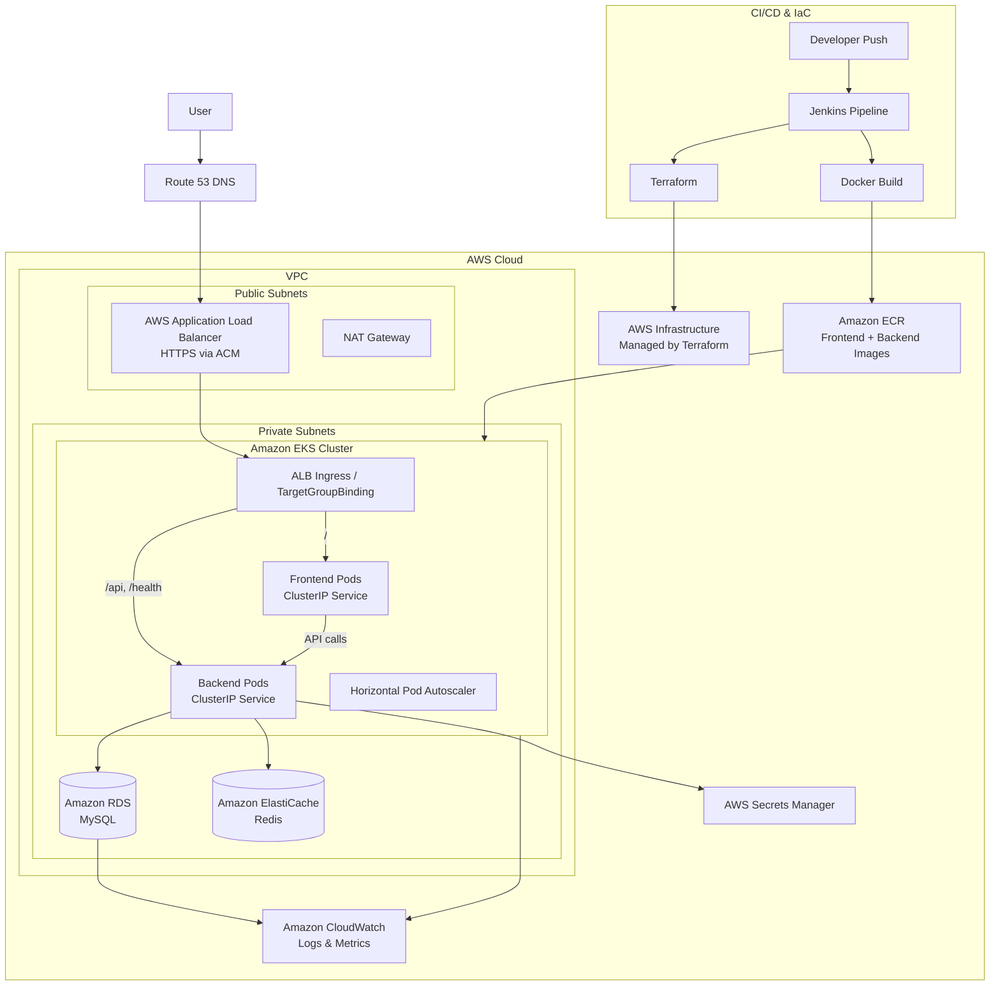

# Project Architecture Summary

## 1. Project Overview

This project is a full-stack Todo application deployed on AWS using a modern container-based DevOps workflow. It includes a static frontend, a Node.js/Express backend, MySQL persistence, and Redis caching.

The application is packaged as Docker images, stored in Amazon ECR, and deployed to Amazon EKS with Kubernetes rolling updates. AWS infrastructure is provisioned with Terraform, while Jenkins automates build, image publishing, infrastructure changes, and application deployment.

**Core technologies:** AWS, Terraform, EKS, Kubernetes, Docker, Jenkins, ECR, ALB, Route 53, ACM, RDS MySQL, ElastiCache Redis, CloudWatch, Node.js, Express, HTML/CSS/JavaScript.

## 2. High-Level Architecture



## 3. Infrastructure Summary

The infrastructure is provisioned with Terraform and organized into reusable modules for networking, compute, container registry, data services, security, DNS, and observability.

**AWS services used:**

- **VPC:** Isolated network boundary for the application platform.
- **Public subnets:** Host internet-facing ALB and NAT Gateway.
- **Private subnets:** Host EKS worker nodes, RDS MySQL, and ElastiCache Redis.
- **Internet Gateway and NAT Gateway:** Provide public ingress and controlled outbound access from private workloads.
- **Application Load Balancer:** Routes external HTTPS traffic to Kubernetes workloads.
- **Amazon EKS:** Runs the frontend and backend containers with Kubernetes orchestration.
- **Amazon ECR:** Stores versioned frontend and backend Docker images.
- **Amazon RDS MySQL:** Persistent relational database for Todo data.
- **Amazon ElastiCache Redis:** Cache layer used by the backend service.
- **AWS Secrets Manager:** Stores database and cache connection secrets consumed by Kubernetes through Secrets Store CSI.
- **Route 53 and ACM:** Provide DNS routing and TLS certificates.
- **CloudWatch:** Central location for EKS, application, frontend, backend, and database logs.

The platform uses public ingress with private workload placement. Kubernetes services remain internal, while the ALB exposes only the required application entry points.

## 4. Request Flow

1. A user accesses the application domain in the browser.
2. Route 53 resolves the domain to the AWS Application Load Balancer.
3. The ALB terminates HTTPS using ACM and redirects HTTP traffic to HTTPS.
4. ALB path rules route `/` traffic to the frontend and `/api` or `/health` traffic to the backend.
5. Kubernetes forwards traffic to healthy frontend or backend pods through ClusterIP services.
6. The backend processes API requests and connects privately to RDS MySQL and Redis.
7. The backend returns a response through Kubernetes, the ALB, and back to the user.

## 5. CI/CD Flow

The Jenkins pipeline automates both application delivery and infrastructure changes.

1. A developer pushes code changes.
2. Jenkins checks out the repository and detects changed paths.
3. Frontend and backend Docker images are built when their respective source paths change.
4. Images are tagged with the Jenkins build number and pushed to Amazon ECR.
5. Jenkins updates the EKS deployment image using `kubectl set image`.
6. Kubernetes performs a rolling deployment and verifies rollout health.
7. If rollout validation fails, Jenkins triggers a Kubernetes rollback.
8. Terraform init, validate, plan, and apply run when infrastructure files change.

## 6. Scaling Strategy

The application is designed for horizontal scaling at both pod and node levels.

- Frontend and backend deployments start with multiple replicas.
- Kubernetes rolling updates keep availability during deployments.
- Horizontal Pod Autoscalers scale pods based on CPU and memory usage.
- EKS managed node groups support cluster-level scaling.
- Cluster Autoscaler IAM permissions are provisioned for dynamic node capacity.
- ALB distributes external traffic across healthy Kubernetes pod targets.

## 7. Security Overview

Security is applied through network isolation, least-privilege access, encrypted services, and controlled secret delivery.

- HTTPS is enforced through ACM certificates and ALB redirect rules.
- Application workloads, RDS, and Redis run in private subnets.
- Security groups restrict database and Redis access to EKS worker nodes.
- Kubernetes NetworkPolicies limit frontend and backend traffic paths.
- IAM Roles for Service Accounts enable AWS access without static credentials in pods.
- Secrets are stored in AWS Secrets Manager and mounted into Kubernetes through Secrets Store CSI.
- RDS storage and EKS node volumes are encrypted.
- ECR image scanning is enabled on push.

## 8. Monitoring & Logging

CloudWatch is the primary observability destination for infrastructure and platform logs.

- EKS control plane logs are enabled for API, audit, authenticator, controller manager, and scheduler events.
- Dedicated CloudWatch log groups exist for application, frontend, and backend logs.
- RDS exports error and slow query logs.
- Kubernetes liveness and readiness probes provide workload health checks.
- Jenkins rollout checks validate deployment health during releases.

## 9. Repository Structure Summary

```text
app/
  frontend/      Static browser UI for the Todo application.
  backend/       Node.js/Express API with MySQL and Redis connectivity.
  docker/        Dockerfiles and local container configuration.
  k8s/           Kubernetes manifests for deployments, services, ingress, HPA, policies, and secrets.
  ci/            Application deployment helper scripts.

infra/
  terraform/     AWS infrastructure as code, organized into reusable Terraform modules.
  ci-cd/         Jenkins pipeline and Jenkins configuration values.

docs/
  Architecture, DevOps, Kubernetes, Terraform, Docker, Jenkins, and troubleshooting documentation.
```

This repository represents a complete AWS-based DevOps project: Terraform provisions the cloud platform, Docker packages the services, Jenkins automates delivery, EKS runs the application, and managed AWS services provide ingress, persistence, caching, security, and observability.
